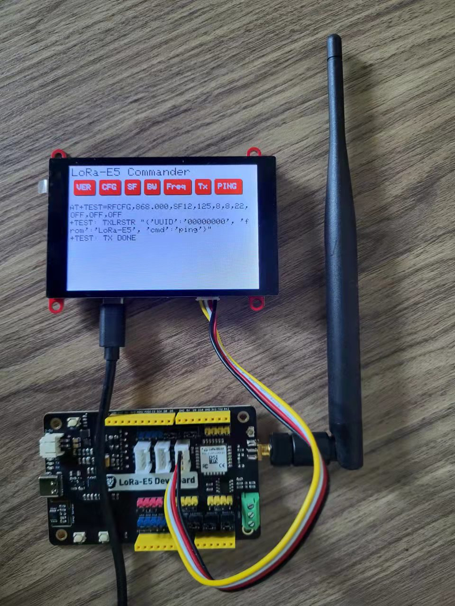

# E5_Controller

A LoRa P2P tester made of a LoRa-E5 and an ESP32-S3 Touch TFT

See [this blog post](https://kongduino.wordpress.com/2022/07/08/lora-e-5-commander/) for details and [this project on Hackster](https://www.hackster.io/projects/553636).

